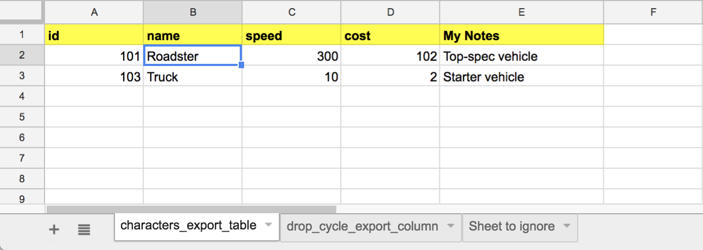

# GDoc Tuning Exporter

**Public domain, do with whatever you like, commercial or not**
**This comes with no warranty, use at your own risk!**

Simple system for exporting JSON data from a Google Spreadsheet, with online/offline importer for Unity (though can be used by anything that likes JSON)

This is a handy tool to let you store and edit your tuning and configuration data in a Google Spreadsheet and access that data in Unity - either at **Runtime** by the published game, or by the **Editor** by running the Unity Editor script. 

This is useful for anyone that wants to have data driven by a spreadsheet model, or to be driven by a live sheet that allows effective continous balancing. Could also be useful for language/localisation data. Or something else! Who knows.

# Setting up the spreadsheet

* Create a new Spreadsheet in Google Spreadsheets
* Make sure that any worksheets you want to export have "_export" at the end, eg. "config_export". The "_export" part will be stripped before export, and this will be used for the attribute name in JSON.
* The top row should contain the titles of the attributes you want to export e.g "id", "speed"
* Any column with spaces in will be ignored e.g "My Notes"

For example, this Spreadsheet:

Will export:

`{characters:[
    {"id":101,"name":"Gary","speed":300:"face_size":102},
    {"id":102,"name":"Barry","speed":10:"face_size":2}
]}`

# Setting up the Script

To allow the data to be exported, you need to set up a *Web Service*, with the following steps:

* Open your Google Spreadsheet
* Make a note of the Document Key (the long string between /d/ and /edit)
* Click on "Tools" > "Script Editor..."
* Name your project - this is essential or the web service won't work
* Paste contents of "ExportTuningData.gs" into "Code.gs" in the script editor window
* Click on Publish and select "Deploy as web app"
* Select new and type a version name (e.g 1)
* In "Execute the app as" select yourself
* In "Who has access to the app" Select "Anyone, even anonymous"
* Click Deploy or Update
* Click "Review Permissions", to Authorize application
* Review list of permissions required, and click "Allow"
* Make a note of the "Current web app URL"

You only need to do this once, rather than for every spreadsheet.

# Getting the data from Unity

* Add **UpdateTuningData.cs** to your **Editor** folder in your Unity project (or create one if needed)
* Swap **PUT_YOUR_WEB_URL_HERE** for the web app url from above
* Swap **YOUR_SPREADSHEET_KEY_HERE** for the Spreadsheet key from above
* Change **TuningData.json** for an appropriate file name

You can also add in as many spreadsheet/file combos as you like, they will be queued

Much credit to https://github.com/techcoop/json-google-docs - really useful examples that informed this little tool!

